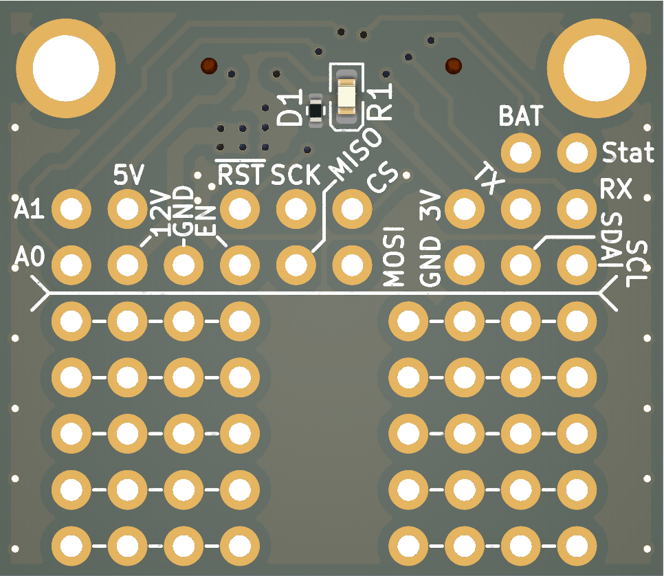
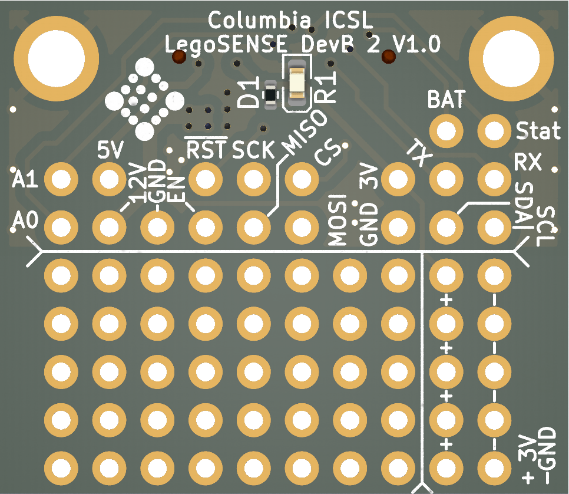
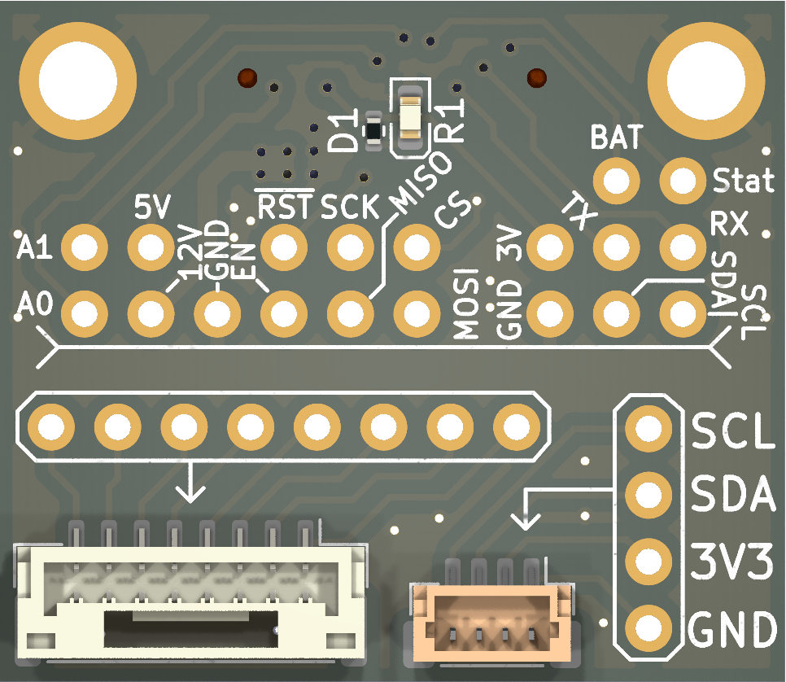
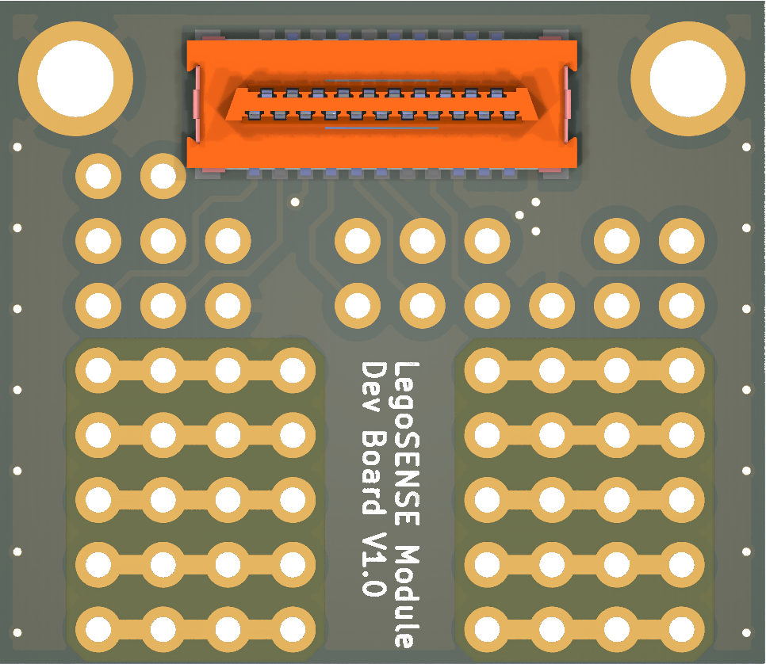
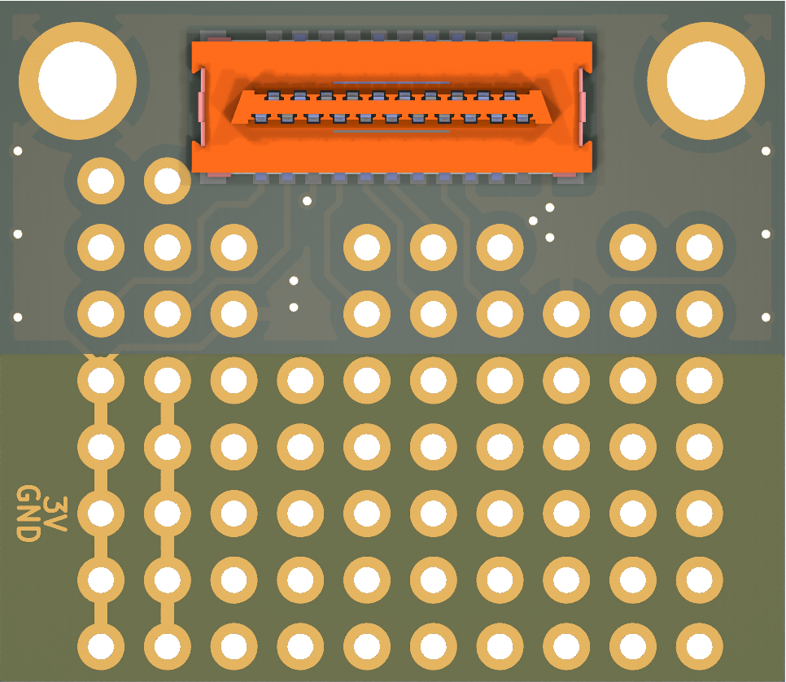
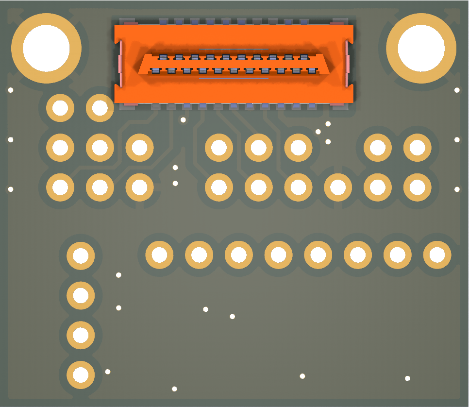

## Getting Started: hardware design steps

#### Step 1: Get Sensor to Work on Breadboard

Acquire a sensor evaluation board (breakout board) and make it work with Raspberry Pi. You may consult the sensor manufacturer for example codes and getting started guides.

<TODO: content>

#### Step 2: Switch to Module Development Board

In this step, you will move the sensor circuit to a module-like development board that can be plugged into LegoSENSE's carrier board.

There are three module development boards you can use as shown below. On the top half of the board, the 21-Pin connector is broken out for soldering; on the bottom half of the board, type 1 employs a breadboard-style layout, type 2 employs a protoboard-style layout and type 3 includes the common 1.25mm JST connector and 1.0mm I2C connector (STEMMA QT / Qwiic).

| Development Board Type 1                       | Development Board Type 2                       | Development Board Type 3                       |
| ---------------------------------------------- | ---------------------------------------------- | ---------------------------------------------- |
|  |  |  |
|  |  |  |

Choose the one that's most convenient for you to work with, and move the circuit from breadboard to the development board and solder it on there.

Plug the evaluation board into carrier board. Depending on which slot you've plugged in, you will need to change the pin definitions in your sensor driver code to match the pin that the specific carrier board module slot uses. You can consult the table under [Carrier Board Bus Layout](#Carrier Board Bus Layout).

#### Step 3: Port code into LegoSENSE Framework

<TODO: content>

#### Step 4: Design and Manufacture Module PCB

<TODO: content>

## File Directory

- `sensor-modules`
  - `air_quality`
  - `color`
  - `human_activity`
  - `imu`
  - `multi_gas`
  - `qwiic`
  - `temp_hum`
  - `thermalcouple`
  - `for_stencil`
- `module-development-boards`: PCB designs for three different module development boards
- `kicad-library`: Submodule linked to a separate GitHub repository containing the PCB library symbols of the components used in the hardware designs.


## Carrier Board Bus Layout
Note: Raspberry Pi GPIO numbering in this table are BCM (broadcom) pin numbers and is not the physical pin on Raspberry Pi board.

|            | I2C                    | SPI                             | UART (TX, RX)                      | ADC         | GPIO |
| ---------- | ---------------------- | ------------------------------- | ---------------------------------- | ----------- | ---- |
| Module 1   | I2C1 <br/>`/dev/i2c-1` | SPI0, CS0 <br/>`/dev/spidev0.0` | UART1 (14, 15) <br/>`/dev/ttyS0`   | ADC1, CH1-2 | 24   |
| Module 2   | I2C1 <br/>`/dev/i2c-1` | SPI0, CS1 <br/>`/dev/spidev0.1` | UART2 (0, 1) <br/>`/dev/ttyAMA1`   | ADC1, CH3-4 | 25   |
| Module 3   | I2C6 <br/>`/dev/i2c-6` | SPI1, CS0 <br/>`/dev/spidev1.0` | UART3 (4, 5) <br/>`/dev/ttyAMA2`   | ADC2, CH1-2 | 26   |
| Module 4   | I2C6 <br/>`/dev/i2c-6` | SPI1, CS1 <br/>`/dev/spidev1.1` | UART5 (12, 13) <br/>`/dev/ttyAMA3` | ADC2, CH3-4 | 27   |
| ADC1       | I2C1, addr=48          |                                 |                                    |             |      |
| ADC2       | I2C1, addr=49          |                                 |                                    |             |      |
| EEPROM MUX | I2C1, addr=70          |                                 |                                    |             |      |

### Raspberry Pi 4 Device Tree Overlay
```
[spi]
gpio=16,17,18,19,20,21=a4
dtoverlay=spi1-3cs
gpio=7,8,9,10,11=a0
dtoverlay=spi0-2cs

[I2C]
dtoverlay=i2c6

[UART]
enable_uart=1
dtoverlay=uart2
dtoverlay=uart3
dtoverlay=uart5
```

### Raspberry Pi 40-Pin Assignments
| Function   | RPi PCB <br/>Pin# (BCM) | RPi PCB <br/>Pin# (BCM) | Function  |
| ---------- | ----------------------- | ----------------------- | --------- |
| 3V3        | **1** (3V3)             | **2** (5V)              | 5V        |
| I2C1_SDA   | **3** (GPIO 2)          | **4** (5V)              | 5V        |
| I2C1_SCL   | **5** (GPIO 3)          | **6** (GND)             | GND       |
| UART3_TX   | **7** (GPIO 4)          | **8** (GPIO 14)         | UART0_TX  |
| GND        | **9** (GND)             | **10** (GPIO 15)        | UART0_RX  |
| SPI1_CE1   | **11** (GPIO 17)        | **12** (GPIO 18)        | SPI1_CE0  |
| GPIO_M4    | **13** (GPIO 27)        | **14** (GND)            | GND       |
| I2C6_SDA   | **15** (GPIO 22)        | **16** (GPIO 23)        | I2C6_SCL  |
| 3V3        | **17** (3V3)            | **18** (GPIO 24)        | GPIO_M1   |
| SPI0_MOSI  | **19** (GPIO 10)        | **20** (GND)            | GND       |
| SPI0_MISO  | **21** (GPIO 9)         | **22** (GPIO 25)        | GPIO_M2   |
| SPI0_SCK   | **23** (GPIO 11)        | **24** (GPIO 8)         | SPI0_CE0  |
| GND        | **25** (GND)            | **26** (GPIO 7)         | SPI0_CE1  |
| UART2_TX   | **27** (GPIO 0)         | **28** (GPIO 1)         | UART2_RX  |
| UART3_RX   | **29** (GPIO 5)         | **30** (GND)            | GND       |
| *Not Used* | **31** (GPIO 6)         | **32** (GPIO 12)        | UART5_TX  |
| UART5_RX   | **33** (GPIO 13)        | **34** (GND)            | GND       |
| SPI1_MISO  | **35** (GPIO 19)        | **36** (GPIO 16)        | SPI1_CE2  |
| GPIO_M3    | **37** (GPIO 26)        | **38** (GPIO 20)        | SPI1_MOSI |
| GND        | **39** (GND)            | **40** (GPIO 21)        | SPI1_SCK  |

## Module Connector
The universal connector used for all modules and carrier boards is a pair of 21 Pin Mezzanine Connectors shown below.

| Adapter Board - 21 Pin Mezzanine Connector Receipt | Sensor Module - 21 Pin Mezzanine Connector Plug |
| -------------------------------------------------- | ----------------------------------------------- |
|           |        |

The layout for the connector is shown below. It includes pins for the common sensor data communication protocols as follows:

- `SCL, SDA`: I2C
- `CS, MOSI, MISO, SCK`: SPI
- `GPIO`: GPIO digital input / output
- `SCL_E, SDA_E`: I2C for EEPROM (used for module auto-recognition and configuration)
- `RX, TX`: UART
- `ADC0, ADC1`: Two analog input channels

